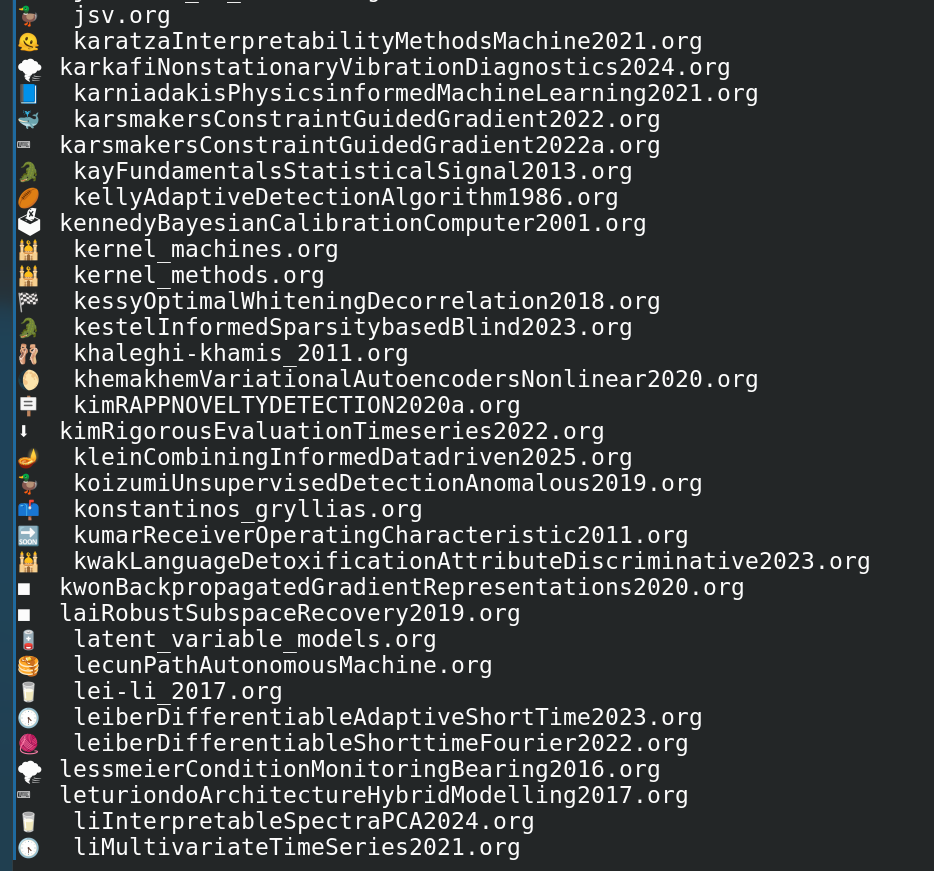
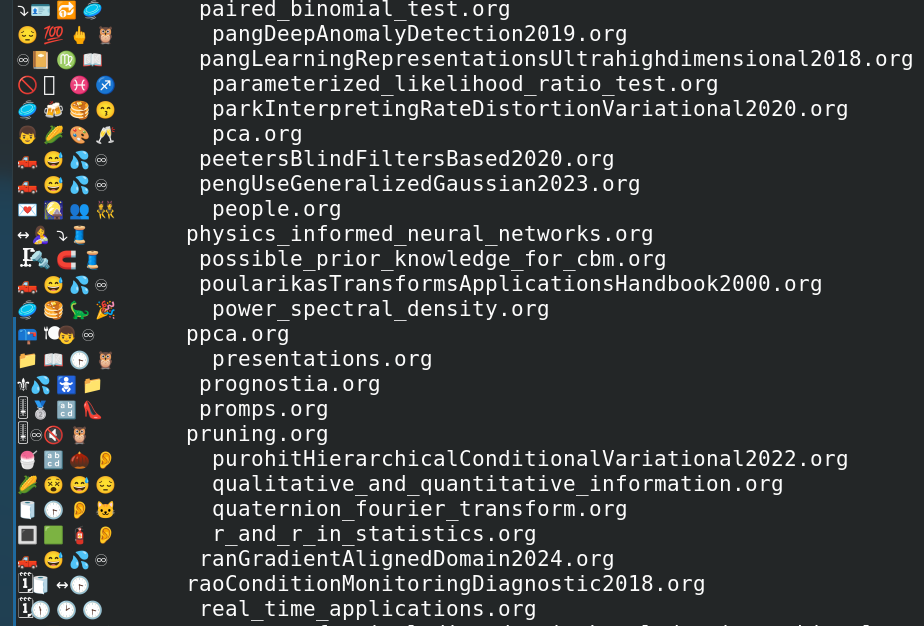

# lse - ls with semantic emojis 🎨

A Python script that enhances directory listings by automatically adding contextual emojis to filenames based on their content using TF-IDF and cosine similarity.

## Screenshots

**Basic usage:**



**Top-k mode (showing multiple emojis per file):**



## How It Works

`lse` uses TF-IDF vectorization + cosine similarity to match file contents with emoji descriptions, giving visual cues about what each file contains at a glance.

## Prerequisites

You need [uv](https://github.com/astral-sh/uv) - a fast Python package installer and runner.

**Install uv:**

```bash
# macOS/Linux
curl -LsSf https://astral.sh/uv/install.sh | sh

# Or with pip
pip install uv

# Or with Homebrew
brew install uv
```

Verify installation:
```bash
uv --version
```

## Installation

### 1. Clone or Download

```bash
git clone <your-repo-url> lse
cd lse
```

Or download the files manually and ensure you have:
- `lse.py`
- `emoji_data.json`

### 2. Make Executable

```bash
chmod +x lse.py
```

### 3. Index Your Files (Required First Step)

Train the model on your codebase to learn what kinds of files you work with:

```bash
./lse.py --index ~/projects
```

This creates a trained model in `~/.lse/` based on your actual files.

**Tips:**
- Index a diverse directory tree (like your entire projects folder) for best results
- The more varied your files, the better the emoji matching
- Re-run indexing anytime to update the model

**Extended Emoji Dataset (Optional):**

By default, `lse` uses a curated set of 20 emojis optimized for code. For more variety and higher entropy, download a random sample from the HuggingFace dataset (5,000+ emojis):

```bash
# Download 150 random emojis (default)
./lse.py --index ~/projects --full-dataset

# Customize sample size
./lse.py --index ~/projects --full-dataset --sample-size 300

# Reset back to default 20 emojis
./lse.py --reset-emojis
./lse.py --index ~/projects  # Re-train with defaults
```

**Why use extended dataset?**
- More diverse and unique emoji assignments
- Higher entropy (less repetition across similar files)
- 150+ emojis vs 20 default emojis

**Why stick with defaults?**
- More predictable, semantic mappings
- Faster training and inference
- Focused on common programming contexts

### 4. Install Globally

To use `lse` from anywhere, you need to add it to your PATH.

#### Option A: Automated Setup (Recommended)

**From the project directory**, run:

```bash
./setup.sh
```

This script will:
- Make `lse.py` executable
- Create `~/.local/bin/` and symlink `lse` there
- Automatically detect your shell (bash/zsh/fish) and add to PATH persistently
- Tell you exactly what it did

Then reload your shell:
```bash
source ~/.bashrc  # or ~/.zshrc, or ~/.config/fish/config.fish
# Or just open a new terminal
```

#### Option B: Manual Setup

**From the project directory:**

```bash
# Create ~/.local/bin if it doesn't exist
mkdir -p ~/.local/bin

# Symlink the script (pwd must be the lse project directory)
ln -s $(pwd)/lse.py ~/.local/bin/lse
```

Then add `~/.local/bin` to your PATH permanently:

**For bash/zsh** - Add to `~/.bashrc` or `~/.zshrc`:
```bash
export PATH="$HOME/.local/bin:$PATH"
```

**For fish** - Add to `~/.config/fish/config.fish`:
```fish
set -gx PATH $HOME/.local/bin $PATH
```

Reload your shell or open a new terminal.

**Test it:**
```bash
lse ~
```

## Usage

```bash
# List current directory with emojis
lse

# List specific directory
lse /path/to/directory

# Show top 3 emojis per file
lse --top-k 3

# Re-index/train on different directory
lse --index ~/new-projects

# Use extended emoji dataset (150 random emojis from 5000+)
lse --index ~/projects --full-dataset

# Customize sample size
lse --index ~/projects --full-dataset --sample-size 300

# Reset to default 20 emojis
lse --reset-emojis

# Configuration management
lse --show-config      # View current config
lse --reset-config     # Reset config to defaults
```

**Data Storage:** All `lse` data is stored in `~/.lse/`:
- `emoji_data.json` - Emoji descriptions (customizable, 20 or 150+ depending on dataset choice)
- `emoji_data.json.backup` - Automatic backup when switching datasets
- `config.json` - Configuration file (display settings, TF-IDF parameters)
- `vectorizer.pkl` - Trained TF-IDF model
- `emoji_vectors.npy` - Pre-computed emoji vectors
- `emoji_list.json` - Emoji symbol list

## Configuration Options

### Configuration File

`lse` uses a JSON configuration file at `~/.lse/config.json` to customize behavior:

```bash
# View current configuration
lse --show-config

# Edit configuration
nano ~/.lse/config.json

# Reset to defaults
lse --reset-config
```

**Default configuration:**
```json
{
  "display": {
    "top_k": 1,
    "separator": ""
  },
  "tfidf": {
    "max_features": 5000,
    "min_df": 2,
    "max_df": 0.95,
    "stop_words": "english",
    "ngram_range": [1, 2]
  },
  "dataset": {
    "default_sample_size": 150
  }
}
```

**Configuration options:**
- `display.top_k`: Number of emojis to show per file (default: 1)
- `display.separator`: String between emojis when top_k > 1 (default: "", try "|" or " ")
- `tfidf.max_features`: Maximum vocabulary size for TF-IDF (default: 5000)
- `tfidf.min_df`: Ignore terms appearing in fewer than N documents (default: 2)
- `tfidf.max_df`: Ignore terms appearing in more than N% of documents (default: 0.95)
- `tfidf.stop_words`: Stop words list, "english" or null (default: "english")
- `tfidf.ngram_range`: N-gram range [min, max] (default: [1, 2] for unigrams and bigrams)
- `dataset.default_sample_size`: Default sample size for --full-dataset (default: 150)

### Top-K Emoji Display

Show multiple emojis per file for more context:

```bash
# Show top 3 emojis per file
lse --top-k 3

# Set default in config
nano ~/.lse/config.json  # Change "top_k": 3
```

**Example with top_k=3:**
```
🐍📝🔧  main.py
📊📈🔍  analysis.csv
```

**Customize separator:**
```json
{
  "display": {
    "top_k": 2,
    "separator": "|"
  }
}
```

Output: `🐍|📝  main.py`

### Create a Shell Alias (Optional)

If you want `ls` to automatically use `lse`, add to your shell config:

**For bash/zsh** (`~/.bashrc` or `~/.zshrc`):
```bash
alias ls='lse'

# Or keep both available
alias ll='lse'
```

**For fish** (`~/.config/fish/config.fish`):
```fish
alias ls='lse'
alias ll='lse'
```

### Customize Emojis

All emoji data is stored in `~/.lse/emoji_data.json`. To customize:

```bash
# Edit the emoji data
nano ~/.lse/emoji_data.json

# Add your custom emojis
{
  "emoji": "🦀",
  "description": "rust programming language systems cargo crate"
}

# Re-index to apply changes
lse --index ~/projects
```

The `setup.sh` script automatically copies `emoji_data.json` to `~/.lse/` during installation. If you want to reset to defaults, copy from the project directory:

```bash
cp /path/to/lse/emoji_data.json ~/.lse/
```

## Troubleshooting

**"Model not found" error**
- Run `lse --index <path>` first to train the model

**All files get the same emoji**
- Index a more diverse directory with varied file types
- Add more specific emoji descriptions to `~/.lse/emoji_data.json`

**Wrong emoji assignments**
- Index a larger corpus: `lse --index ~/projects`
- Improve emoji descriptions to be more distinctive
- The model learns from your actual files, so index representative code

**Slow performance**
- Reduce `max_features` in [lse.py:107](lse.py#L107) from 5000 to 1000
- Index a smaller directory tree

## How the ML Works

1. **Training (`--index`):**
   - Recursively reads all files in the indexed directory
   - Fits a TF-IDF vectorizer on the combined corpus (files + emoji descriptions)
   - Computes emoji vectors using the same vectorizer
   - Saves model artifacts to `~/.lse/`

2. **Inference (default):**
   - Loads trained vectorizer and emoji vectors
   - Transforms each file's content into a TF-IDF vector
   - Computes cosine similarity between file and all emoji vectors
   - Assigns the emoji with highest similarity score

**Key parameters:**
- `max_features=5000`: Vocabulary size
- `min_df=2`: Ignore rare terms (appear in < 2 docs)
- `max_df=0.95`: Ignore very common terms (appear in > 95% of docs)
- `ngram_range=(1,2)`: Use both unigrams and bigrams

## License

MIT
